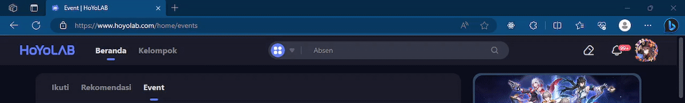
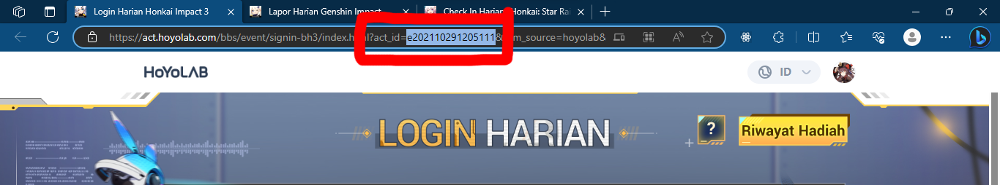
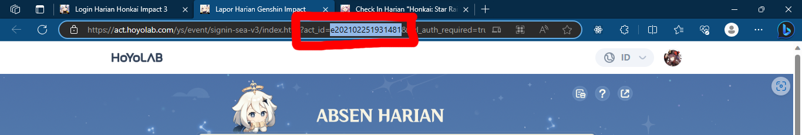
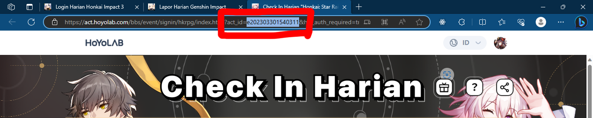

<h1 align="center">hoyolab-check-in-cli</h1>

<p align="center"><strong>Sebuah alat untuk melakukan daily check-in pada akun honkai impact, genshin impact, honkai star rail kalian.</strong></p>

## Instalasi

- **Git** dan **Node.js** harus sudah terinstall di komputer kalian
- **Clone** atau **download** repository ini
- Masuk ke foldernya dan lakukan **npm install** dan **npm link**

```shell
git clone https://github.com/Md-E7/hoyolab-check-in-cli

cd hoyolab-check-in-cli

npm install

npm link
```

## Penggunaan

- Jika tidak bisa menggunakan command berikut artinya hoyolab-check-in-cli tidak terinstall dengan benar

```shell
hoyolab-check-in-cli --help

# Usage: hoyolab-check-in-cli [options] [command]
#
# Sebuah alat untuk melakukan daily check-in pada akun honkai impact, genshin impact, honkai star rail kalian.
#
# Options:
#  -V, --version   output the version number
#  -h, --help      display help for command
#
# Commands:
#  account         Untuk menambah, mengambil, memperbarui, menghapus akun hoyolab
#  start           Untuk melakukan check-in otomatis pada akun hoyolab
#  help [command]  display help for command

hoyolab-check-in-cli account --help

# Usage: hoyolab-check-in-cli account [options] [command]
#
# Untuk menambah, mengambil, memperbarui, menghapus akun hoyolab
#
# Options:
#  -h, --help      display help for command
#
# Commands:
#  add             Untuk menambah data akun hoyolab
#  get <name>      Untuk mengambil data akun hoyolab
#  update <name>   Untuk memperbarui data akun hoyolab
#  remove <name>   Untuk menghapus data akun hoyolab
#  list            Untuk mengambil semua data akun hoyolab
#  help [command]  display help for command
```

### Cara mendapatkan cookie akun hoyolab

- Copy kode ini

```javascript
const button=document.createElement("button");button.innerText="Copy cookie",button.onclick=()=>{navigator.clipboard.writeText(document.cookie),alert("Cookie berhasil di copy")},document.head.innerHTML="",document.body.innerHTML="",document.body.appendChild(button);
```

- Buka **website hoyolab** dan hapus url di address bar
- Dan ganti menjadi **javascript:(kode yang di atas paste di sini)** dan klik enter
- Setelah di enter klik tombol **"Copy cookie"**



### Cara mendapatkan act_id akun hoyolab

- Buka **check-in page**
- Dan lihat di bagian address bar cari **?act_id=**
- Dan copy di bagian depannya saja

#### honkai impact act_id

- **Contoh di check-in page honkai impact**



#### genshin impact act_id

- **Contoh di check-in page genshin impact**



#### honkai star rail act_id

- **Contoh di check-in page honkai star rail**


